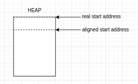
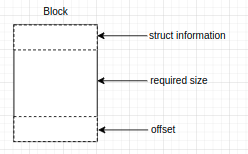
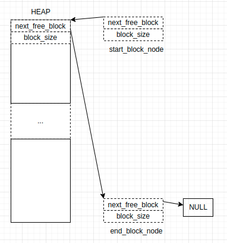
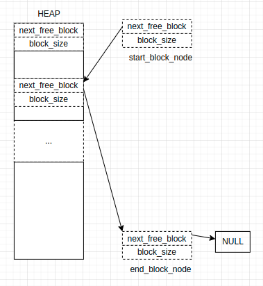
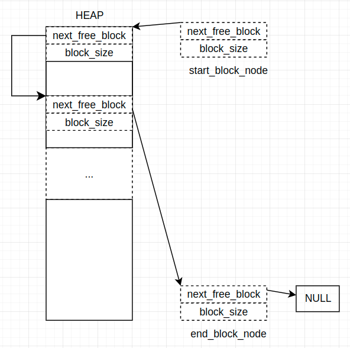

`
### user_malloc() && user_free

#### Design Gole

Implementation user's own malloc() and free() functions, which are portable with ones from standard library.
Assume there is a specific memory location, which can be used as a whole heap for malloc() and free().
Address alignment should be considered.

#### Design Details

##### heap location

The whole heap is located in a specific memory block. We can define a memory section in link script and restrict the heap array into this section.

```ld
MEMORY
{
  FLASH  (rx) : ORIGIN = 0x08000000, LENGTH = 512K
  RAM    (rwx) : ORIGIN = 0x20000000, LENGTH = 128K
  HEAP_SEC (rwx) : ORIGIN = 0x20002000, LENGTH = 4K
}

SECTIONS
{
  .my_section (NOLOAD) :
  {
    KEEP(*(.heap_section))
  } > HEAP_SEC
}
```

```c
static uint8_t heap[MAX_HEAP_SIZE] __attribute__((section(".heap_section")))
```

##### block structure

With every malloc() function, one block of heap will be reserved to the function caller, and the pointer to the useable area in this block will be retuned.

From C programming perspctive, a structure saving the block information should be defined. This also means, that the block consists of two part: one saving the structure variable, one for real usage.

The structure can be defined as:
```c
typedef struct heap_block {
    struct heap_block* next_free_block;
    size_t block_size;
} heap_block_t;
```

##### address alignment

Two kind of address alignments should be considered.

1. heap start address alignment. If this address is not aligned, then alignment calculation should be taken. The aligned address is the start address of heap block as well.
<p align="center">
  
</p>


2. block address alignment. The required size of malloc may lead to not aligned address for next block. Thus an offset of required memory should be considered.
<p align="center">
  
</p>

Following code can be used for address alignment:
```c
#define ALIGNMENT_BYTES  16
#define ALIGNMENT_MASK   (~ ( (size_t) ( ALIGNMENT_BYTES-1 ) ) )

void* address_alignment(void* addr) {
    (void*) ( ( (size_t)(addr) + ALIGNMENT_BYTES - 1 ) & ALIGNMENT_MASK );
}

// here block should start from an aligned address
size_t size_alligned(size_t required_size) {
    // size_t off_set = ALIGNMENT_BYTES - ( retuired_size & ALIGNMENT_MASK );
    return ( required_size + ALIGNMENT_BYTES - ) & ALIGNMENT_MASK
}
```
##### allocation process

**note:** In Free RTOS, the MSB of member block_size in heap_block struct indicates if the block is assigned to function or kernel or it is a free block. In this way some space can be saved, otherwise an extra member can be defined to such indication.

One linked list of heap_block_t is used to mantain the free blocks. All free blocks in this list are sorted in increasing order of block_size, which ensure that the first suitable block can be choosen.

To create this list, one start node with block_size 0 and end node with block_size MAX_HEAP_SIZE should be defined. The block_size ensures that start node always at the begining and the end node always in the end.

The whole heap should also be initialized as a block. Thus after initialization the heap and list should be looked like this: 
<p align="center">
  
</p>

If the block isassigned to application or kernal, the MSB of block_size should be set and this block should be removed from the list.

if the required is smaller than the block_size (some threshold can be used), then this block can be divided into two blocks, one for assigment, another as free block and inserted into the list.
<p align="center">
  
</p>


##### free process
Freee process is relative easy, MSB of block_size should be reset to indicate free. The freed block should be inserted back into the list.
<p align="center">
  
</p>